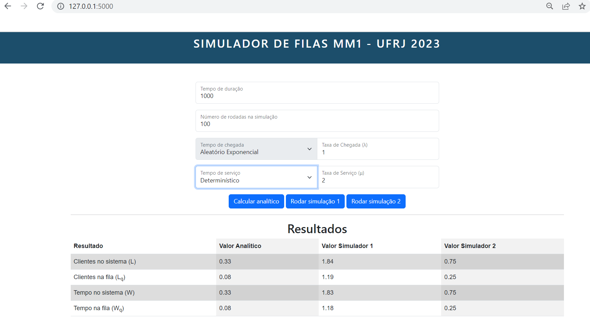

# Simulação de Filas

Projeto de Simulação de uma Fila M/M/1 da disciplina MAD 2023.01

## O que é uma fila M/M/1?

Uma fila M/M/1 é um sistema que contém um único servidor para atender clientes, onde tanto o tempo de atendimento quanto o intervalo entre chegadas são exponenciais e seguem um processo de Poisson. Este sistema é caracterizado por ser um processo estocástico, onde as variáveis de estado são aleatórias. O conjunto de estados possíveis inclui o número de clientes no sistema, incluindo aqueles que estão sendo atendidos, representados pelos valores 0, 1, 2, 3, e assim por diante. O diagrama de estado abaixo ilustra o funcionamento de uma fila M/M/1.

O relatório completo deste trabalho foi desenvolvido em latex e poderá ser consultado através [deste link](https://www.overleaf.com/read/cbtghctbjzkx).

## Arquivos disponíveis

### Exploração através de Jupyter notebook

Na primeira versão do simulador de filas, foi realizada a criação de um notebook em Jupyter para facilitar no desenvolvimento em Python e na plotagem dos gráficos.

Para visualizar e executar os arquivos confira o diretório **notebooks**.
Será necessário ter o Python instalado na versão 3.6+ e instalar as libs indicadas no topo de cada notebook.

### Versão web do simulador

Caso prefira navegar diretamente através de uma interface web, você pode executar a versão localmente.

1. Instale o python 3.6+ e o flask em sua máquina
2. Acesse o diretório **interface web** e rode o arquivo **app.py**
3. Caso tudo funcione como o esperado, será exibido uma URL local no terminal para visualizar o projeto 

